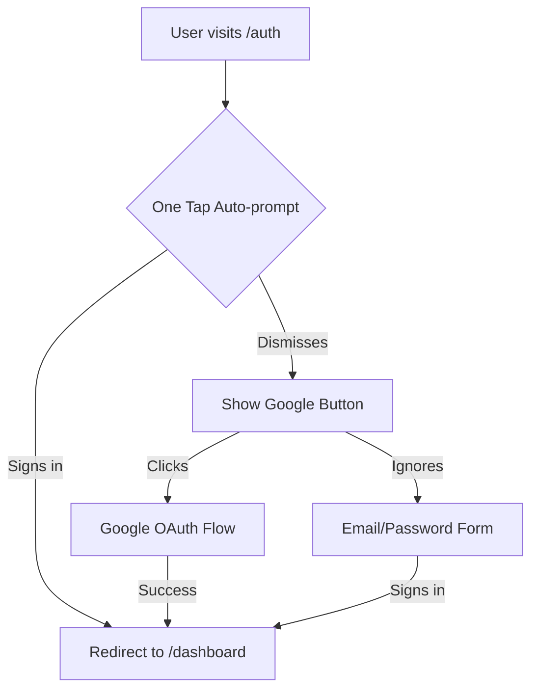

# Google Authentication Configuration

This guide covers the setup for Google One Tap + Google Sign-In button authentication in InvoiceFlow.

## Features

- **Google One Tap**: Primary authentication method - auto-prompts on page load for seamless sign-in
- **Continue with Google Button**: Secondary fallback if One Tap is dismissed
- **Email/Password**: Traditional fallback authentication

## Google Cloud Console Setup

### 1. Create OAuth 2.0 Credentials

1. Go to [Google Cloud Console](https://console.cloud.google.com)
2. Create a new project or select existing: `InvoiceFlow`
3. Navigate to **APIs & Services** → **Credentials**
4. Click **Create Credentials** → **OAuth client ID**
5. Configure the OAuth consent screen (if not done already)

### 2. Configure OAuth Client

**Application type**: Web application

**Authorized JavaScript origins**:
```
https://invoiceflow.dev
http://localhost:3000
https://localhost:5173
```

**Authorized redirect URIs**:
```
https://yqzzcvkgeoghirfrflzq.supabase.co/auth/v1/callback
https://invoiceflow.dev/auth/callback
http://localhost:3000/auth/callback
```

### 3. Save Credentials

Copy your **Client ID** and **Client Secret** - you'll need these for the next steps.

## Supabase Configuration

### 1. Enable Google Provider

1. Go to [Supabase Dashboard](https://supabase.com/dashboard/project/yqzzcvkgeoghirfrflzq)
2. Navigate to **Authentication** → **Providers**
3. Find **Google** and enable it
4. Enter your **Client ID** and **Client Secret** from Google Cloud Console
5. Save changes

### 2. Configure Redirect URLs

1. Go to **Authentication** → **URL Configuration**
2. Set **Site URL**: `https://invoiceflow.dev` (production) or `http://localhost:3000` (dev)
3. Add to **Redirect URLs**:
   ```
   https://invoiceflow.dev/auth/callback
   http://localhost:3000/auth/callback
   http://localhost:5173/auth/callback
   ```

## Environment Variables

Create a `.env` file in your project root (copy from `.env.example`):

```bash
# Google OAuth Configuration
VITE_GOOGLE_CLIENT_ID="your-actual-client-id.apps.googleusercontent.com"

# Supabase Configuration
VITE_SUPABASE_URL="https://yqzzcvkgeoghirfrflzq.supabase.co"
VITE_SUPABASE_PUBLISHABLE_KEY="your-anon-key"

# Site Configuration
SITE_URL="https://invoiceflow.dev"
```

**IMPORTANT**: Replace `your-actual-client-id` with the actual Client ID from Google Cloud Console.

## Testing

### Local Development

1. Start the dev server: `npm run dev`
2. Navigate to `http://localhost:3000`
3. Google One Tap should auto-prompt (if not dismissed previously)
4. If dismissed, use "Continue with Google" button
5. Fallback to email/password if needed

### Production

1. Deploy to `invoiceflow.dev`
2. Test all three flows:
   - One Tap auto-prompt
   - Google button after dismissal
   - Email/password fallback

## Troubleshooting

### One Tap doesn't appear

- Check browser console for errors
- Ensure `VITE_GOOGLE_CLIENT_ID` is set correctly
- Clear cookies and try in incognito mode
- Check that domain is in Authorized JavaScript origins

### "redirect_uri_mismatch" error

- Verify all redirect URIs are added to Google Cloud Console
- Ensure exact match including protocol (http/https)
- Check Supabase redirect URLs match

### "Invalid credentials" error

- Verify Client ID and Secret are correct in Supabase
- Check that Google Provider is enabled in Supabase
- Ensure OAuth consent screen is configured

### One Tap dismissed too many times

Google One Tap has built-in dismissal protection. If a user dismisses it multiple times, it won't show for a while. Test solutions:
- Clear browser cookies
- Use incognito mode
- Use "Continue with Google" button instead

## User Flow



## Security Notes

- Never commit your actual Client ID/Secret to version control
- Use different credentials for dev/staging/production
- Regularly rotate Client Secrets
- Monitor OAuth usage in Google Cloud Console
- Enable only necessary OAuth scopes (email, profile)

## Support

If you encounter issues:
1. Check console logs for errors
2. Verify all configuration steps above
3. Test in incognito mode
4. Contact support with error messages

## Resources

- [Google Identity Services](https://developers.google.com/identity/gsi/web)
- [Supabase Google Auth](https://supabase.com/docs/guides/auth/social-login/auth-google)
- [Google One Tap](https://developers.google.com/identity/one-tap/web)
